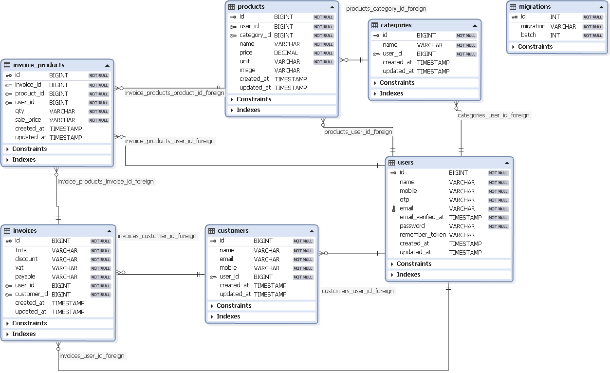
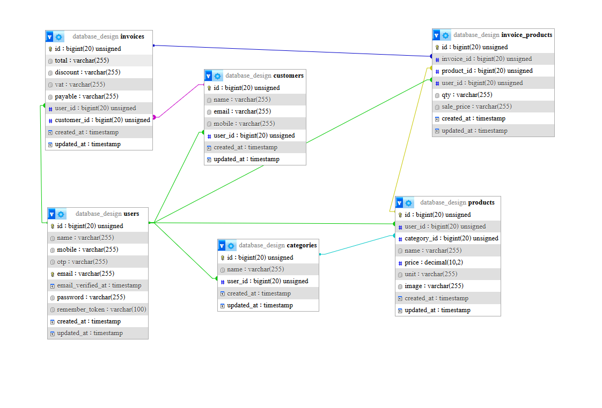

# Database Design

This document provides an overview of the database structure for the project, including Entity-Relationship (ER) diagrams and table relationships. 

---

## ER Diagram in DBForge

The following diagram represents the database structure as visualized in **DBForge Studio for MySQL**. It shows all tables, primary keys, foreign keys, and relationships clearly.

img.readme/Diagram1.bmp

---

## Table Structure in phpMyAdmin

The screenshot below shows the same database structure in **phpMyAdmin**, highlighting the table columns and their types.

# Laravel Template 

## click the link below to watch project video

